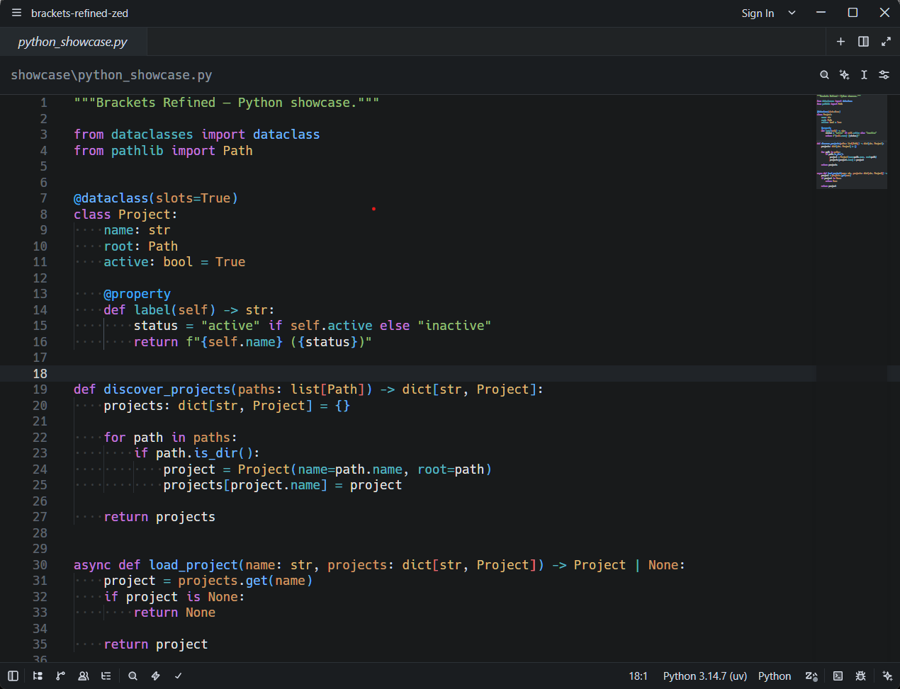
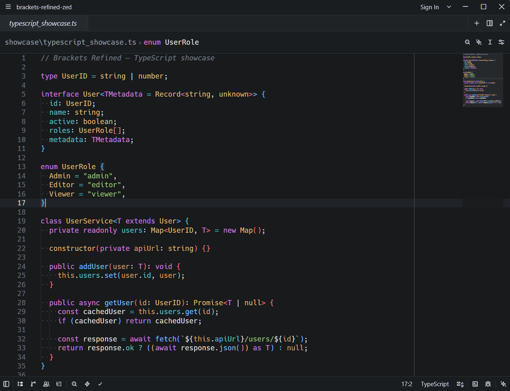
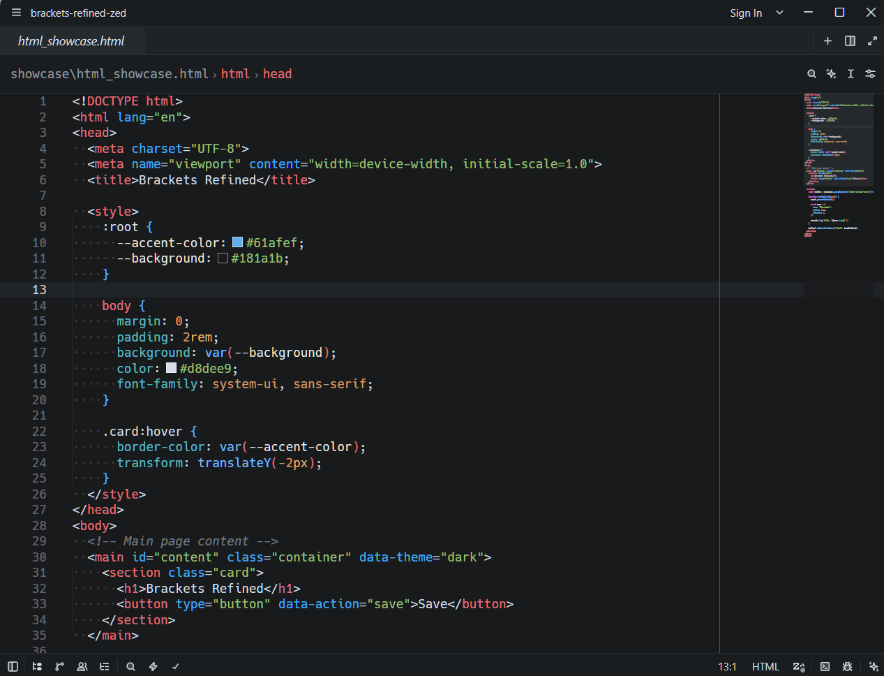

# Brackets Refined

A carefully refined dark theme for [Zed](https://zed.dev/) with a neutral interface and a balanced, expressive syntax palette.

## About

**Brackets Refined** preserves the clean, focused character associated with Brackets while adapting its visual language to Zed's modern interface and syntax highlighting system.

The theme uses a near-black neutral background, restrained UI contrast, muted secondary text, and a compact set of syntax colors chosen to keep code structure easy to scan without making the editor visually noisy.

## Screenshots

### Python



### TypeScript



### HTML & CSS



## Key Features

- Near-black `#181A1B` editor background
- Neutral, low-distraction workbench surfaces
- Clear active, hover, selection, and focus states
- Balanced syntax highlighting for functions, types, parameters, properties, strings, and constants
- Coordinated diagnostics, Git, diff, and debugger colors
- Complete terminal ANSI palette
- Minimap and scrollbar states matched to the UI palette
- Markdown and embedded-language highlighting
- Tested with Python, Markdown, CSS, HTML, JavaScript, and TypeScript

## Syntax Palette

| Element | Color |
| --- | --- |
| Functions & Methods | `#74B9FF` |
| Types, Classes & Interfaces | `#E5C07B` |
| Keywords | `#C678DD` |
| Type Parameters | `#C678DD` |
| Namespaces & Modules | `#56B6C2` |
| Properties | `#56B6C2` |
| Parameters | `#D19A66` |
| Numbers & Constants | `#D19A66` |
| Variables | `#E8E8E8` |
| Strings | `#98C379` |
| Tags | `#E06C75` |
| Attributes & Decorators | `#3FA9F5` |
| Comments | `#6F7681` *italic* |

## Installation

**Brackets Refined** is available from Zed's Extensions catalog.

1. Open Zed.
2. Open **Extensions**.
3. Search for **Brackets Refined**.
4. Click **Install**.
5. Open the Theme Selector and select **Brackets Refined**.

### Development Installation

Clone this repository, open Zed's Extensions view, choose **Install Dev Extension**, and select the repository root — the directory containing `extension.toml`.

## Development

The Zed theme definition is located at:

```text
themes/brackets-refined.json
```

After changing the theme, use **Rebuild** for the development extension in Zed's Extensions view to reload it.

## Acknowledgements

Brackets Refined is an independent theme for Zed inspired by the visual style and syntax highlighting of the Brackets code editor.

Thanks to the Brackets and Zed communities and their contributors for the tools, documentation, and ecosystem that made this theme possible.

This project is not affiliated with, endorsed by, or sponsored by Adobe, the Brackets project, or Zed Industries.

## License

Brackets Refined is released under the MIT License. See [LICENSE](LICENSE).
